# Projet Final Structure de données

**Membre du binome**

- Amayas Sadi 28717408
- Hamid Kolli 28717594

* Groupe : 03

---

# Exercice 01

## Question 01

La fonction `Chaines *lecture_chaines(FILE *file)` permet de lire la structure de chaines à partir d'un fichier tout en testant l'existence du fichier aprés on reccupere le nombre de chaines et la valeur de gamme ensuite on boucle tant que la fin du fichier n'est pas atteinte et qu'il reste encore des chaines, et pour chaque chaine on reccupere son numéro et le nombre de points puis on boucle sur les points en reccuperant leurs x et y

## Question 02

- La fonction `void ecrire_chaines(Chaines *C, FILE *file)` permet d'ecrire la structure de chaines dans un fichier avec le même format qu'en lecture

- Le fichier `ChaineMain.c` est un fichier de test pour les fonction de lecture et d'écriture de chaines

*Voici un exemple de test sur le fichier `resources/05000_USA-road-d-NY.cha`*

- Affichage avant l'utilisation de la fonction d'ecriture

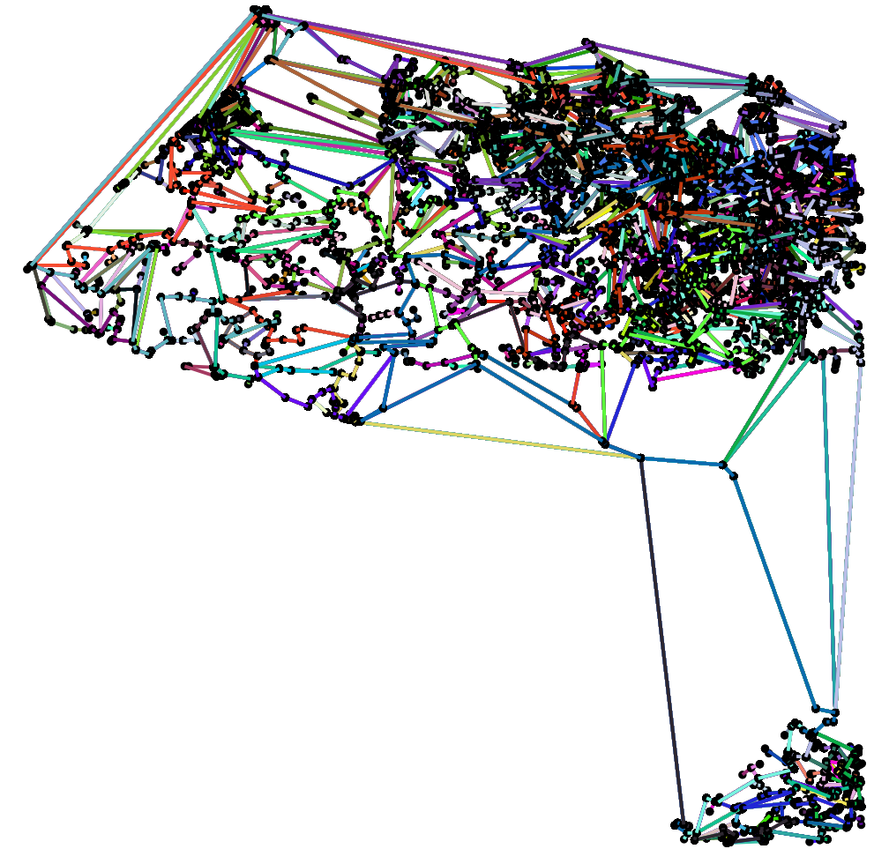

- Affichage aprés l'utilisation de la fonction d'ecriture

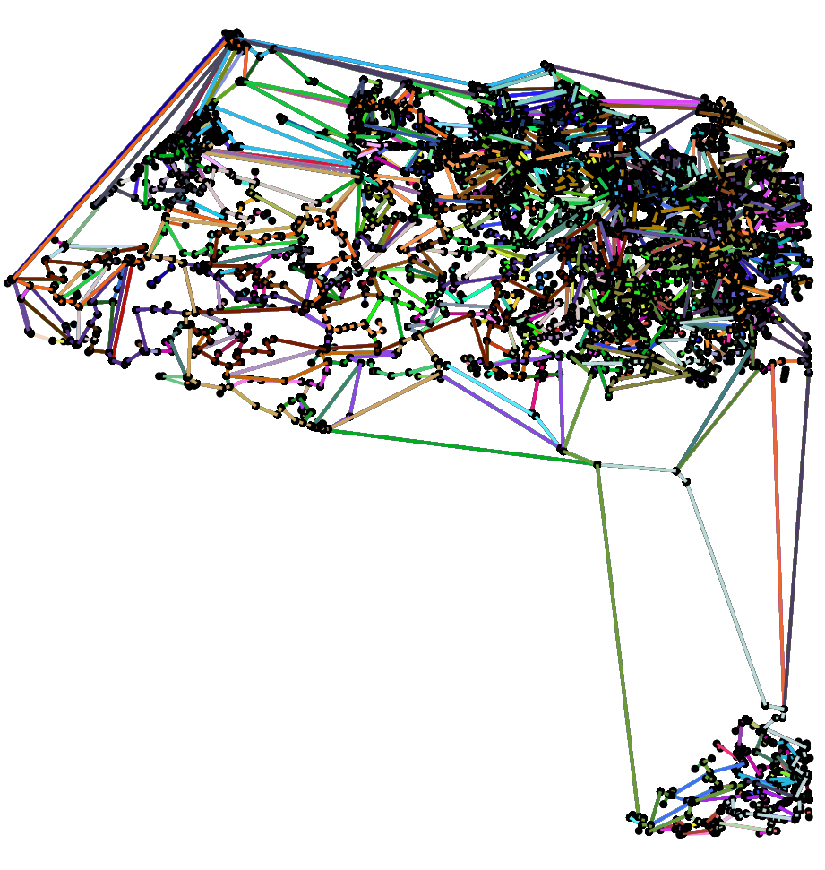

## Question 03

- Affichage de la structure de chaines aprés la lecture des chaines depuis le fichier `00014_burma.cha`

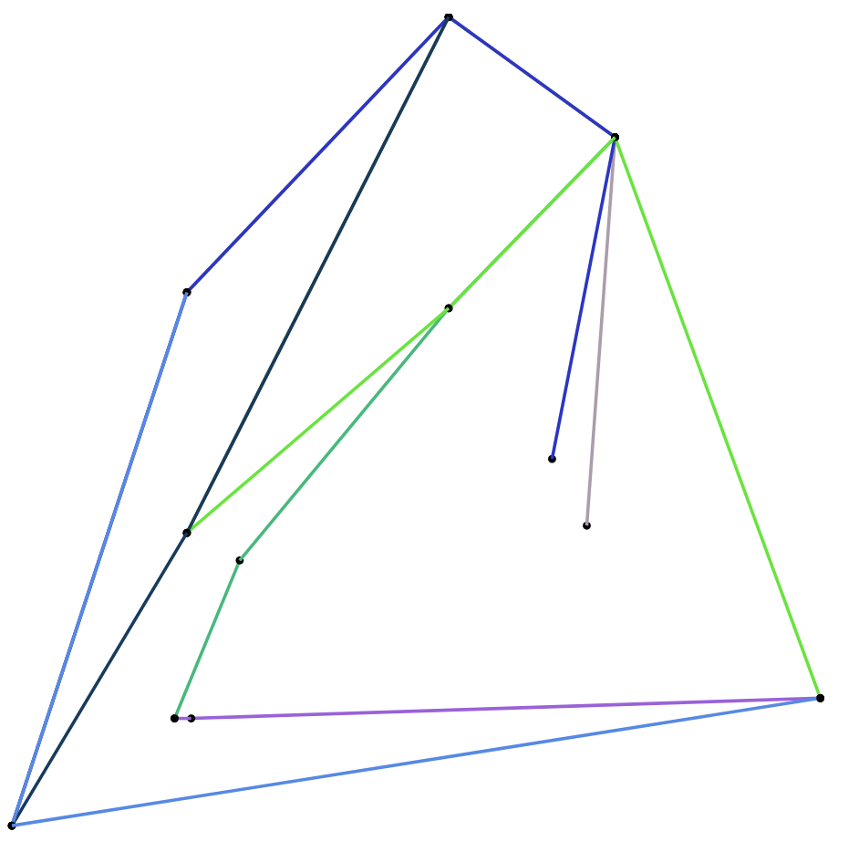

## Question 04

`double longueur_chaine(CellChaine *C)` : On parcours tout les points de la cellChaine et on calcule la somme des distances entre les points en utilisant une fonction static qui calcule la distance entre 2 points voici son code

```c
/* Calcule la distance entre deux points */
static double distance_points(CellPoint *p1, CellPoint *p2) {
    if (!p1 || !p2) return 0;
    return sqrt(pow((p1->x - p2->x), 2) + pow((p1->y - p2->y), 2));
}
```

`double longueur_totale(Chaines *C)` : Calcule juste la somme des longueur_chaine pour toutes les cellChaine


## Question 05

`int compte_points_total(CellChaine *C)` : Calcule le nombre de points totales de la structure, en parcourant la liste en pour chaque cellchaine on ajoute son nombre de points qui est calcule avec la fonction `int compte_points_chaines(CellChaine *C)` dont voici son code

```c
/* Calcule le nombre de points d'une chaine */
int compte_points_chaines(CellChaine *C) {
    int nb_points = 0;

    /* On calucle le nombre de points */
    for (CellPoint *points = C->points; points; points = points->suiv, nb_points++) continue;
    return nb_points;
}
```
# Exercice 02

- NB : On a deplacé les definitons de la structure Noeud, CellNoeud et CellCommodite dans les fichier `Noeud.{c, h}` pour éviter les problemes d'importation *(multi-include)* en effet les fichier `Reseau` à besoin des fichiers `ÀrbreQuat` et `Hachage` qui eux mêmes ont besoin de `Reseau` plus precisement des definitions de Noeud, CellNoeud et CellCommodite, donc on a prefere de déplacer les definitions des structures ainsi que leurs fonctions de création, libération dans les fichier `Noeud.{c,h}`

## Question 01

`Noeud *recherche_cree_noeud_liste(Reseau *R, double x, double y)` : Parcours la liste des noeuds du reseau en cherchant si le point (x, y) se trouve si c'est le cas elle le retourne sinon elle créer un nouveau noeud de coordonnees (x, y), l'ajoute dans le reseau et le retourne

## Question 02

`Reseau *reconstitue_reseau_liste(Chaines *C)` : La fonction permet de reconstruire le reseau depuis la structure de chaines en suivant l'algorithme de reconstitution avec l'implementation de $p \in V$ avec les listes de noeuds


## Question 03

Le main du fichier `ReconstitueReseau.c` prend en parametre un nom de fichier sans extension et le numéro de la méthode à utiliser

Le main ouvre le fichier en lui ajoutant l'extension `.cha` et selectionne la structure correspondante :

    1- pour les listes
    2- pour la table de hachage
    3- pour les arbres

# Exercice 03

## Question 01

`int nb_commodites(Reseau *R)` : On calcule la longeur de la liste des commodites

`int nb_liaisons(Reseau *R)` : On calcule le totale des nombres de voisins et on le devise sur 2 pour avoir le nombre de liaisons

## Question 02

`void ecrire_reseau(Reseau *R, FILE *file)` Permet d'écrire le réseau dans un fichier suivant le format du fichier `00014_burma.res`

## Question 03

- Voici le résultat de l'affichage du réseau (reconstruit à partir du fichier `05000_USA-road-d-NY.cha`)

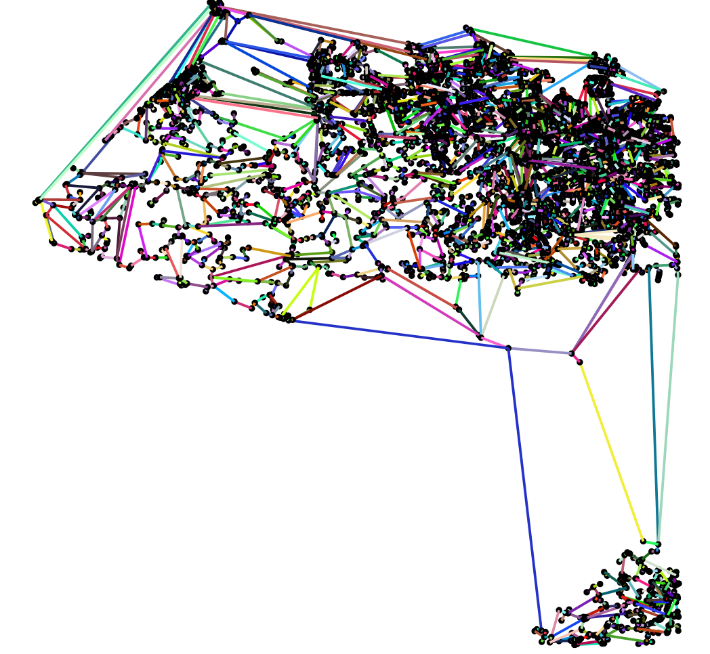

# Exercice 04

## Question 01

- Voici la structure de la table de hachage

```c
typedef struct table {
    CellNoeud **table;
    int lenght;
} TableHachage;
```

Elle est composé d'un tableau de pointeur vers des CellNoeud et la taille de la table

## Question 02

- Voici le main de test de la fonction clé *(Dans le fichier `test_fonction_hachage.c`)* :

```c
// La fonction de clé
int key(int x, int y) {
    return y + (x + y) * (x + y + 1) / 2;
}

int main() {
    // On boucle de 1 à 10 et on affiche les resultats
    for (int i = 1; i <= 10; i++)
        for (int j = 1; j <= 10; j++)
            printf("%d %d = %d\n", i, j, key(i, j));
}
```

On voit que les 100 combinaisons donnes des valeurs uniques, la fonction de clé est bijective

Pour être sûr on a fait un traitement shell sur le résultat avec la commande 

```sh
./test_fonction_hachage | sed -En 's/.* .* = (.*)/\1/p' | sort -n -r | uniq -c | sed -En 's/ *(.*) .*/\1/p' | sort -n -r | uniq -c
```

Et voici le résultat d'affichage : 

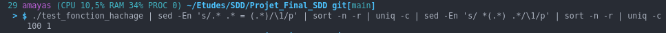

Toutes les 100 lignes (donc les 10 * 10 iterations) donnent un résultat unique

- NB : Pour voir le résultat sur votre console vous pouvez lancer le fichier `test_fonction_hachage.sh` avec les commandes suivante

```sh
chmod u+x test_fonction_hachage.sh
./test_fonction_hachage.sh
```

## Question 03

Voici le code de la fonction de hachage utilisée

```c
// Fonction de hachage
int hachage(double key, int lenght) {
    float a = (sqrt(5) - 1) / 2.0;
    double kA = key * a;
    long kA_int = (long)kA;

    return (int)(lenght * (kA - kA_int));
}
```

- NB : La fonction de création de la table de hachage est en $O(lenght)$ avec lenght est la taille de la table car on parcours toutes les cases de la table pour les mettre à NULL

## Question 04

`Noeud *recherche_cree_noeud_hachage(Reseau *R, TableHachage *hash_table, double x, double y)` : On recupere l'indice de la liste avec le hachage sur la clé (x, y) et on parcours cette liste en cherchant si le point (x, y) se trouve si c'est le cas elle le retourne sinon elle créer un nouveau noeud de coordonnees (x, y), l'ajoute dans le reseau et le retourne

## Question 05

- NB : On a change la signature de la fonction en ajoutant la table de hachage en parametre parceque la création est trés couteuse et donc la reconstitution est désavantage et vu qu'on cherche le temps de reconstitution ça foire les résultats
  
`Reseau *reconstitue_reseau_hachage(Chaines *C, TableHachage *table_hachage)` : La fonction permet de reconstruire le reseau depuis la structure de chaines en suivant l'algorithme de reconstitution avec l'implementation de $p \in V$ avec la table de hachage

# Exercice 05

## Question 01

`void chaine_coord_min_max(Chaines *C, double *xmin, double *ymin, double *xmax, double *ymax)` : On parcours la listes des chaines et on cherches les max et les min des coordonnees

## Question 02

`ArbreQuat *creer_arbre_quat(double xc, double yc, double cote_x, double cote_y)` : L'allocation mémoire et l'initialisation des champs

## Question 03

`void inserer_noeud_arbre(Noeud *noeud, ArbreQuat **arbre, ArbreQuat *parent)` : Permet d'inserer un noeud dans un arbre suivant l'algorithme proposé

## Question 04

`Noeud *recherche_cree_noeud_arbre(Reseau *R, ArbreQuat *arbre, ArbreQuat *parent, double x, double y)` : On recherche par recursivité dans l'arbre le noeud de coordonnees (x, y) on le retourne si on le trouve sinon on l'ajoute et on le retourne

L'algorithme de recherche avec la fonction `Noeud *recherche_noeud_arbre(ArbreQuat *arbre, double x, double y)` : 

* Si l'arbre est NULL alors le noeud (x, y) n'existe pas
* Sinon, Si le noeud de la racine n'est pas NULL on compare si c'est le bon ou pas
* Sinon on determine le sous arbre ou descendre selon les coordonnees x et y et les coordonnees de la racine

Voici son code :

```c
// Permet de rechercher un noeud dans un arbre (en fonction de ses coordonnes(x,y))
Noeud *recherche_noeud_arbre(ArbreQuat *arbre, double x, double y) {
    // si l'arbre n'est pas allouer on returne null (le noeud n'existe pas)
    if (!arbre)
        return NULL;

    /*
    * Si l'arbre existe et contient un noeud ,
    * on verifie si les coordonne sont egaux au celle du noeud de l'arbre si oui on le returne sinon on return null 
    */
    if (arbre->noeud) {
        if (arbre->noeud->x == x && arbre->noeud->y == y)
            return arbre->noeud;

        return NULL;
    }
    // On continue de decendre dans la branche ou se trouve le noeud (en fonction de ses coordonnes)
    if (arbre->xc > x) {
        if (arbre->yc > y)
            return recherche_noeud_arbre(arbre->so, x, y);

        return recherche_noeud_arbre(arbre->no, x, y);
    }

    if (arbre->yc > y)
        return recherche_noeud_arbre(arbre->se, x, y);

    return recherche_noeud_arbre(arbre->ne, x, y);
}
```

## Question 05

`Reseau *reconstitue_reseau_arbre(Chaines *C, ArbreQuat *arbre)` : La fonction permet de reconstruire le reseau depuis la structure de chaines en suivant l'algorithme de reconstitution avec l'implementation de $p \in V$ avec les arbres

# Exercice 06

## Question 01

Le fichier `main.c` est un main de test pour les temps des fonctions de reconstruction, On boucle 10 fois en variant la taille de la table de 10000 à 20000 et à chaque iteration on calcule le temps de reconstruction pour chaque méthode et on écrit les résultat dans un fichier

- Voici les resultats avec le fichier `00014_burma.cha`

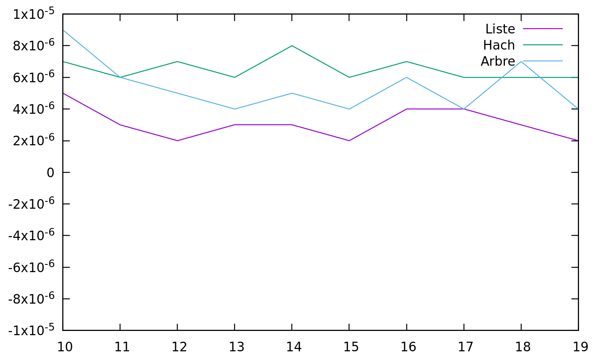

**Observation** : On remarque que les trois méthodes donnent à peu prés les mêmes résultats à $10^{-6}$ prés, mais on remarque que la méthode des liste à un petit avantage

- Les résultats avec le fichier `05000_USA-road-d-NY.cha`

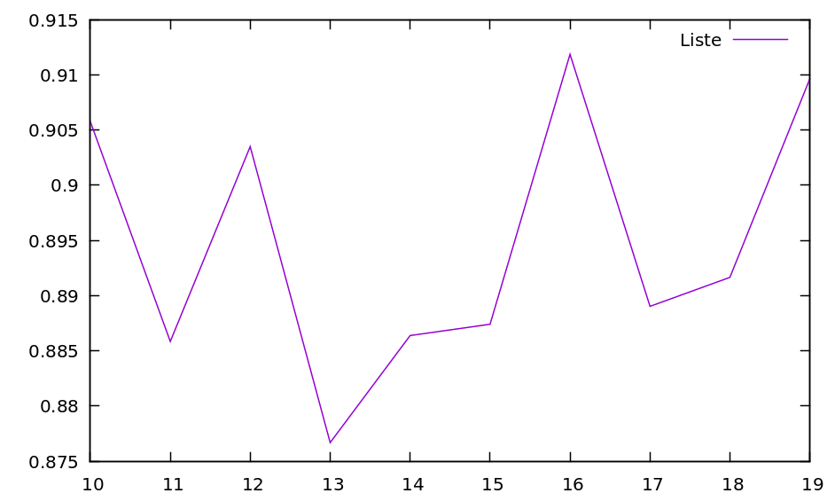
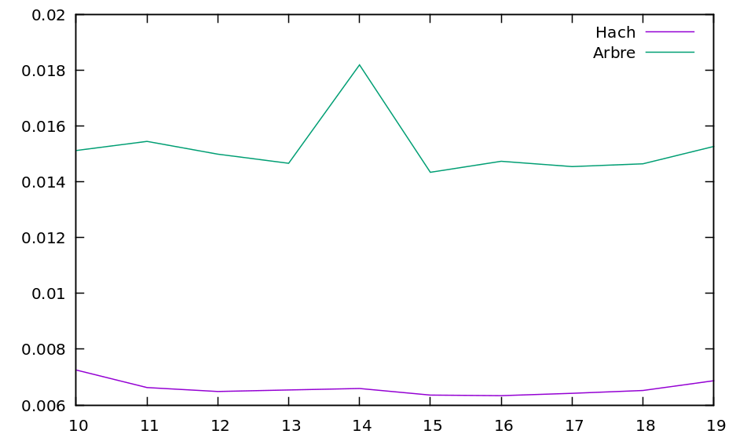

**Observation** : On remarque que la méthode avec la table de hachage est la plus performante par rapport aux autres, et que la méthode avec les listes est la moins performante de toutes

- Les résultats avec le fichier `07397_pla.cha`

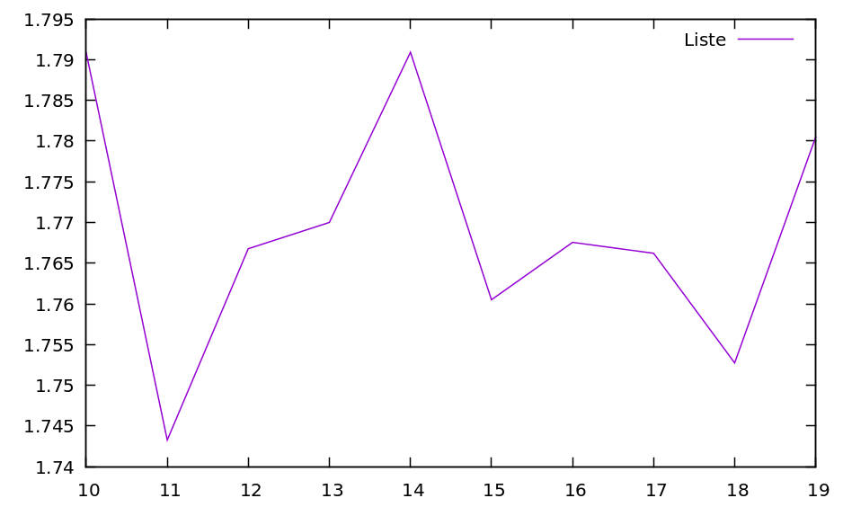
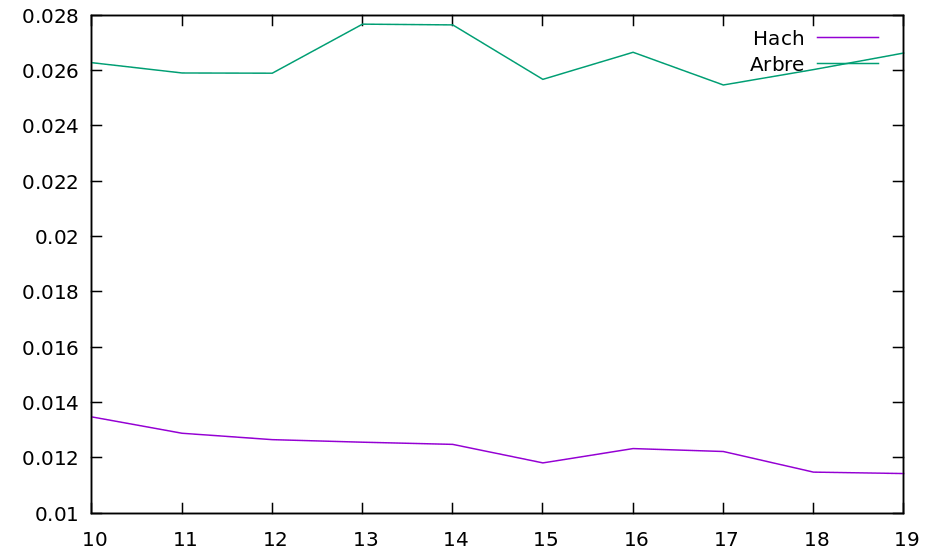

**Observation** : C'est la même Observation qu'avec les résultats du fichier `05000_USA-road-d-NY.cha`

## Question 02

`Chaines *generation_aleatoire(int nb_chaines, int nb_points_chaines, int xmax, int ymax)` : Pour chaque chaines on lui crée `nb_points_chaines` points avec des coordonnees aleatoires entre (0, xmax) et (0, ymax)

## Question 03

Les graphique obtenus :

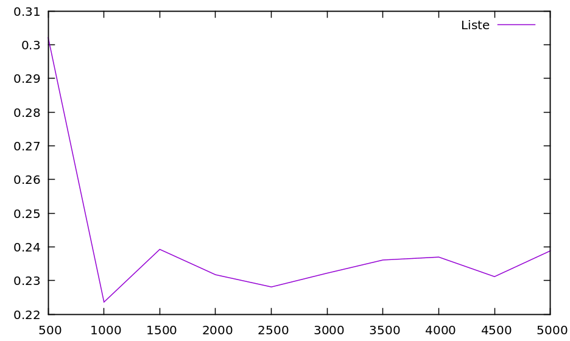
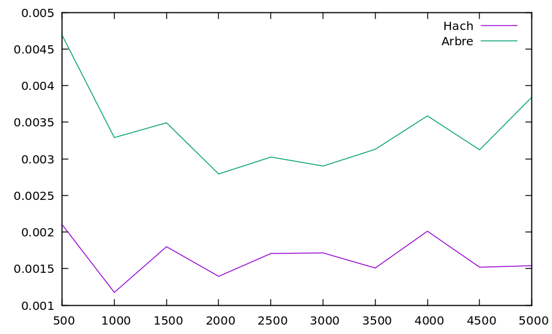

## Question 04

- Pour le fichier `00014_burma.cha` : Dans ce fichier on a pas beaucoup de chaines et de points donc la liste des noeuds ne contient pas beaucoup de noeuds c'est pour cela que la recherche dans la liste n'est pas trop couteuse, parcontre avec les deux autres méthodes on effectue des calcules qui à petite echelle (petit nombre de points) sont desavantageux par rapport à la liste, et comme y a pas beaucoup de noeuds les temps de calcules des differentes méthode est presque le même 

- Pour les fichiers `05000_USA-road-d-NY.cha` et `07397_pla.cha` : 

On remarque dans ce cas que la méthode avec la liste est la plus mauvaise.

Les algorithme de reconstitution sont les mêmes sauf dans la recherche donc ils auront le même nombre d'operation sauf lors de la recherche, et donc c'est que la recherche qui influent sur les temps de calcule, en effet la complexité de recherche avec les liste est de $O(nbChaine * nbPointChaine)$ ce qui est bien pire qu'une complexité de $O(log_4(nbChaine * nbPointChaine))$ pour la recherche avec la méthode des arbre et pire que $O(\alpha)$ pour la recherche en utilisation la table de hachage (avec $\alpha$ est le nombre moyen de noeuds dans une liste de la table)

- Pour la `generation_aleatoire` : 
  
C'est la même analyse qu'avec les fichiers `05000_USA-road-d-NY.cha` et `07397_pla.cha`

# Exercice 07

## Question 01

`Graphe *creer_graphe(Reseau *reseau)` : Alloue la memoire pour le graphe et les differents sommets et aretes, tout en recopiant les commodites dans le tableau de commodites du graphe et en parcourant la liste des noeuds pour fabriquer les sommets et leur chainage

## Question 02

`int plus_petit_nb_aretes(Graphe *graphe, int u, int v)` : Retourne le plus petit nombre d'aretes entre deux sommets en utilisant un parcours en largeur et un tableau pour garder le minimum d'aretes parcourues pour arriver au sommet i

## Question 03

`void generate_plus_petit_chaine(Graphe *graphe, int u, int v, ListeEntier *liste)` : L'idée et de garder dans une liste d'entier les numéros des sommets qui represente la chaine depuis le sommet u jusqu'au sommet v, et donc au lieu de garder le nombre d'aretes parcourues on garde le sommet d'ou on vient ainsi à la fin en faisant un parcours inverse on recupere le chemin le plus court de u vers v

- NB : On a choisis de donner une liste en parametre avec un passage par adresse pour direcement la changer au lieu de créer une autre et la retourner

## Question 04

`int reorganise_reseau(Reseau *reseau)` : Permet de savoir si un réseau est bien repartie (càd : Que on a au max gamma commodites passant par une aretes) en utilisant le graphe et une matrice sommet-sommet pour calculer le nombre de fois qu'on passe par unr arete a qui est entre les sommet i et j donc on voit la valeur de la case `mat[i][j]` : 

```'
mat[i][j] : represente le nombre de  fois qu'on a passé par l'arete ij
et donc si existe un i et j tel que mat[i][j] > gamma alors le reseau n'est pas bien organisé 
```

## Question 05

- Pour les fichier fournie càd `00014_burma.cha`, `05000_USA-road-d-NY.cha` et `07397_pla.cha` : On a toujours un resultat de `0` donc les reseaux correspondants ne sont pas bien organisés 

- Solution pour améliorer la fonction : 
    pass